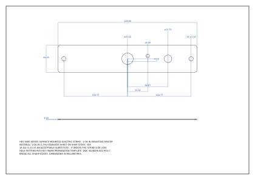

# HES 9400 - 1/16" mounting spacer

A 1/16" shim that goes behind an **HES 9400, 9400 Series Slim-Line Surface
Mounted Electric Strike** (satin stainless steel, 630) to stand it off the frame.
Same footprint as the strike body, so it disappears behind it, with clearance
for both mounting screws, both wiring holes, and the optional lockdown screw.

HES ships the 9400 with a 1/8" spacer plate and sells the 9000-1xx plates as
accessories; this is the half-thickness one for when 1/8" is too much and
nothing is the wrong amount.



## Files

| File | What it is |
|---|---|
| `HES-9400-spacer-1_16in.FCStd` | the model: a real `PartDesign::Body` with the full feature timeline, plus the dimensioned drawing sheet |
| `HES-9400-spacer-1_16in.FCStd.gwtcad.json` | the GWT-CAD companion file (parameters, feature expressions, material) |
| `HES-9400-spacer-1_16in.step` | STEP export, for CAM or for sending to a shop |
| `drawing-preview.svg` | flat render of the drawing sheet, so the part is readable without opening anything |
| `build_spacer.py` | the script that builds all of the above from the numbers below |

## The timeline

Open it in GWT-CAD (or stock FreeCAD - it is a native document either way) and
every step is live and editable:

```
Sketch    Plate Outline                   9" x 1-3/4" rectangle, centred on the latchbolt centreline
Extrude   Plate                           padded to plate_thickness
Fillet    Corner Breaks                   R1/8" on the four corners
Sketch    Mounting Hole Profile
Extrude   Mounting Holes                  2X, through all
Sketch    Wiring Clearance Profile
Extrude   Wiring Clearance                power + LBM/LBSM, through all
Sketch    Lockdown Clearance Profile
Extrude   Lockdown Clearance (optional)   suppress this one if you are not using it
```

Every sketch is fully constrained, and the plate thickness and corner radius
are driven by parameters (`plate_thickness`, `corner_radius`) rather than typed
numbers. **To get the 1/8" version instead, change `plate_thickness` to
`0.125 in` in the parameters panel** - the model, the drawing and the STEP all
follow.

## Dimensions

Everything is off the HES frame-preparation template, so the spacer's holes
line up with the holes already drilled in the frame. X runs along the strike
with +X toward the top as installed; the latchbolt centreline is the origin.

| Feature | Inches | mm |
|---|---|---|
| Plate length (= strike body) | 9 | 228.60 |
| Plate width | 1-3/4 | 44.45 |
| Thickness | 1/16 | 1.5875 |
| Corner radius | 1/8 | 3.175 |
| Mounting screw clearance, 2X | 9/32 dia at 4-1/8 each side of the centreline | 7.14 at +/-104.78 |
| Power wiring clearance | 3/4 dia, on the latchbolt centreline | 19.05 at 0 |
| LBM/LBSM wiring clearance | 1/2 dia at 2-5/8 above the centreline | 12.70 at +66.68 |
| Lockdown screw clearance (optional) | 0.236 dia at 1-5/16 above the centreline, 3/16 off the width centreline away from the door | 6.00 at +33.34, -4.76 |

All four of the mounting/wiring holes sit on the width centreline (the
template dimensions them 4X at 7/8 from the door-side edge of a 1-3/4 wide
body). The lockdown hole is the one that does not: the template puts it
1-1/16 in from that same edge.

Mass as modelled, in 304 stainless: about 121 g.

## Where the numbers come from

- **HES 9400 Series data sheet** (Hanchett Entry Systems / ASSA ABLOY,
  `AADSS1203091.pdf`, updated 6/11/25): body 9" [228.6] x 1-3/4" [44.5] x
  9/16" [14], stainless construction, 630 satin stainless finish, ships with
  one 1/8" spacer plate, 9000-1xx spacer plates listed as accessories.
- **HES 9400/9500/9600/9700 Series Installation Instructions**, doc
  `3026006.002 rev C`, page 4 "Frame Preparation": 2X mounting holes for
  1/4"-20 x 1" screws at 4-1/8" [104.8] each side of the latchbolt centreline,
  4X at 7/8" [22.5] across the width, 3/4" [19] clearance for power wiring on
  the centreline, 1/2" [12.7] clearance for LBM/LBSM wiring, 1-5/16" [33.3]
  steps to the optional 10-32 UNF / 10-24 UNC lockdown screw at 1-1/16" [27.0]
  in from the door-side edge.

## Decisions worth knowing about

- **Hole sizes are clearances, not the frame's.** The frame is tapped 1/4-20
  and the strike's own holes provide the horizontal adjustment; the spacer only
  has to pass the screws, so its mounting holes are 9/32" clearance.
- **The wiring holes match the frame preparation exactly** (3/4" and 1/2")
  rather than being opened up. If you would rather have extra room for a
  connector, raise `power_hole_dia` / `lbm_hole_dia`.
- **The lockdown hole is deliberately oversized** (6 mm against the ~5.2 mm a
  #10 screw needs). Its position across the width is the one dimension read
  off the template's 1-1/16" callout rather than a symmetry, so the extra
  margin covers it. Not using the optional lockdown screw? Suppress the
  `Lockdown Clearance (optional)` feature and the hole is gone.
- **1/16" of standoff also moves the strike 1/16" toward the door.** Check the
  latchbolt still engages properly before committing, and re-do the strike's
  horizontal adjustment (loosen the two 1/4"-20 screws, align, re-tighten, then
  the set screws) after fitting it.
- **Material**: 1/16" (1.59) stainless sheet or shim stock, 304. 16 gauge
  (1.51) is an acceptable substitute and is easier to find; it stands the
  strike off 0.08 mm less.

## Rebuilding it

The model is generated, so the script is the source of truth. It drives the
GWT-CAD sidecar over the same JSON-RPC API the app's ribbon uses:

```bash
cp config.example.json config.local.json    # point "freecadcmd" at your FreeCAD
python3 models/hes-9400-spacer/build_spacer.py
```

The build is self-checking: it refuses to finish if a sketch comes out
under-constrained, if the corner fillet cannot find exactly four edges, or if
any dimension on the drawing measures something other than what it is labelled
to measure.
